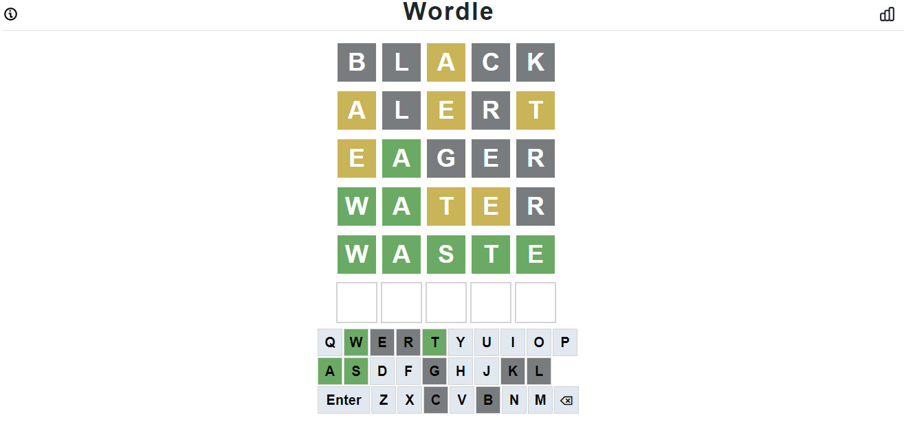

# Wordle
* 功能介紹：

  * 用前端 HTML、CSS、JavaScript建置Wordle遊戲  

  * 搭配Bootstrap實現對話窗效果
  * 使用Local Storage 紀錄遊玩成績   

* GitHub Page : https://gardy11.github.io/

# ScreenShots

* home-page

* game-info

* game-page

